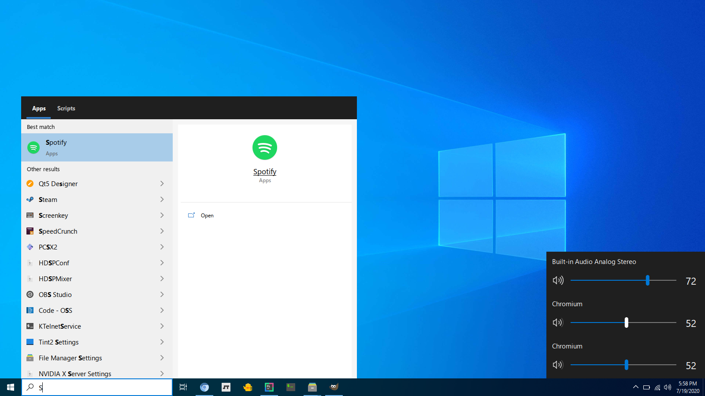
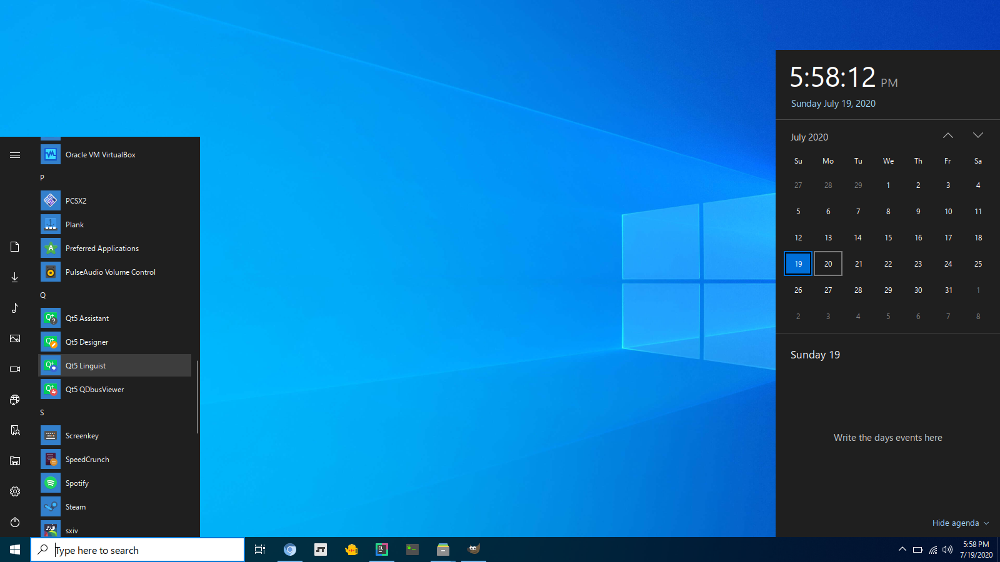

# Winbar
A familiar Xorg panel/dock to ease new linux users transition




## Before building
Make sure the following are on your system

Requirements | Reason
------------ | -------------
git | to clone this repository
cmake | to find required dependencies on your system
make | to compile generated make files from cmake
gcc | a c++ compiler
pkg-config | to find packages
cairo | to paint rectangles
pango | to load fonts and lay them out
librsvg-2.0 | to load svg images
xcb | to open windows with the Xorg server
pangocairo | to paint pango text layouts using cairo
xcb-randr | to gain brightness control
xcb-aux | to really flush the Xorg server
xcb-record | to bind the windows key
pulseaudio-devel | to control pulseaudio
xcb-ewmh | to make it easier to handle extended windows manager hints requests
xcb-icccm | to make it easier to handle icccm requests
xcb-xkb | to handle translating key presses to actual text
xkbcommon-x11 | to handle translating key presses to actual text
libconfig++ | to parse config files
xcb-keysyms | to translate keysyms
xcb-image | to manipulate images
unzip | to unzip the resources

On voidlinux you can run the following to get set up for compiling
```bash
sudo xbps-install -S git gcc cmake make pango-devel cairo-devel librsvg-devel libxcb-devel xcb-util-devel pulseaudio-devel xcb-util-wm-devel libxkbcommon-devel libxkbcommon-x11 libconfig++-devel xcb-util-keysyms-devel xcb-util-image-devel papirus-icon-theme lxappearance unzip
```

## Installation
* Download the source and enter the folder
```bash
git clone https://github.com/jmanc3/winbar
cd winbar
```
* Put the resources and config where they are needed or you'll have missing icons
```bash
unzip winbar.zip -d ~/.config
```
* It's recommended you set Papirus as your systems icon theme (you can use something like lxappearance to do that)


* Finally once you've done everything above, do the following.
```bash
./install.sh
``` 
If compilation fails, it should tell you what headers are missing and you can look up what you need to install for your distribution to get that library.

## Configuration
You are going to want to change the value of the interface variable in the config file so we display correct network status information.
The config file should be located at "~/.config/winbar/winbar.cfg" and it has useful comments about what the variables mean in there.
You can also create and change themes in there.

## Environment
The recommended windows manager to use is Openbox and we make use of the following attoms

Atom | Reason
------------ | -------------
_MOTIF_WM_HINTS | To let the windows manager know which decorations, titlebars for instance, are okay to put on the window
_NET_ACTIVE_WINDOW | To check which window is the active one 
_NET_CLIENT_LIST_STACKING | To check how windows are stacked
_NET_SYSTEM_TRAY_OPCODE | For the systray
_NET_SYSTEM_TRAY_S | For the systray 
_NET_WM_DESKTOP | To see which desktop we are on
_NET_WM_STATE | To set the state
_NET_WM_STATE_ABOVE | Keep the window above all others
_NET_WM_STATE_DEMANDS_ATTENTION | See if window demands attention
_NET_WM_STATE_SKIP_PAGER | To check if a windows wants to not be displayed on the pager
_NET_WM_STATE_SKIP_TASKBAR | To check if a window wants to not be displayed on the taskbar
_NET_WM_STATE_STICKY | To tell the windows manager to make the window show up on all screens
_NET_WM_WINDOW_TYPE_DOCK | To let the windows manager know the type of the window is a dock
_NET_WM_WINDOW_TYPE_NORMAL | To let the windows manager know the type of the window is just a regular window
MANAGER | To become the systray manager
WM_CHANGE_STATE | To change the state of window
WM_DELETE_WINDOW | To receive delete notifications on a window
WM_PROTOCOLS | To check what atoms are supported
WM_STATE | To check the state of a window


